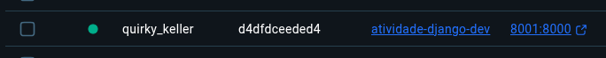
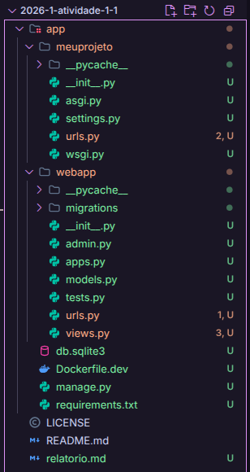
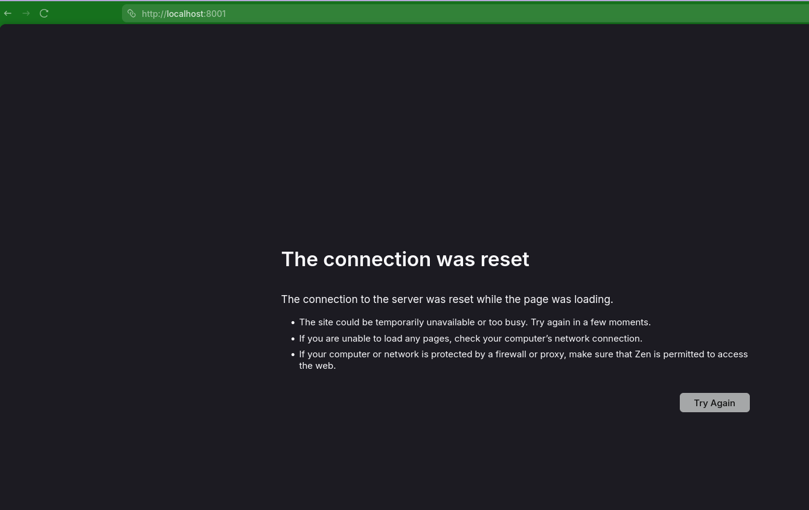
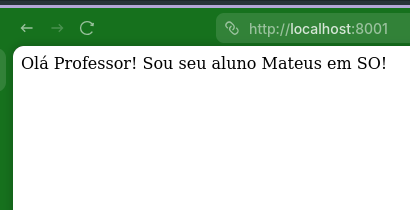
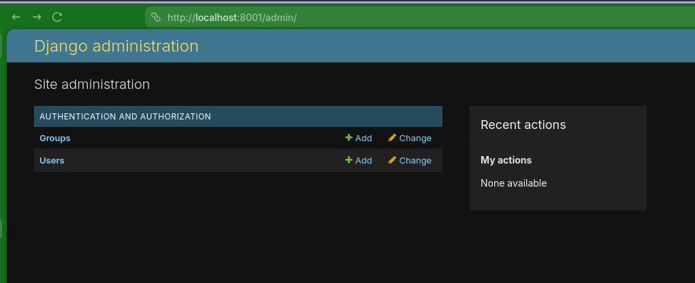

# Relatório de Atividade 1 - Sistemas Operacionais
# Mateus Felipe de Souza Damasceno

## 1. Inicialização do projeto

Segui o processo descrito no README do projeto para inicializar o container. Criei a imagem e construí o container com os comandos sugeridos.

A criação correu bem e o container apareceu normalmente na interface do painel do docker desktop:

## 2. Acessando e criando o projeto

Para acessar o container, utilizei o comando sugerido, que me deu acesso ao shell com o terminal fish

Após acessar o container, executei os comandos do django para criação de projeto e app, todos funcionaram normalmente e a estrutura ficou como a seguir:

dentro de app na minha máquina foram criadas as duas pastas e arquivos relevantes para django, bem como o banco de dados sqlite gerado pelas migrations do django.

Executei também o comando de criação de superusuário para poder acessar o admin do django.

## 3. Rodando e acessando o servidor

### 3.1. Erro inicial e debug

Ao tentar rodar o servidor com o comando sugerido, obtive o seguinte erro:

O navegador não estava conseguindo acessar o servidor. O terminal com o servidor do django não mostrava nenhuma requisição recebida. Assumi que havia algum problema com o roteamento das requisições do host para o container.

Contei a situação para um Agente de IA que executou alguns comandos e chegou ao diagnóstico de que havia um **conflito de portas** com um container que uso para o servidor do projeto do meu trabalho, pois ele também utiliza a porta 8000. Ele também sugeriu que eu trocasse a o mapeamento da porta do host para 8001.

Após fazer essa alteração o erro persistiu, porém eu consegui deduzir que o mapeamento do próprio django pudesse ser um problema, a saída do servidor mostrava que ele estava escutando em 127.0.0.1, mas eu precisava que fosse em 0.0.0.0. Fiz essa alteração e troquei a porta no navegador para 8001 e finalmente consegui acessar o servidor.

## 4. Acessando as páginas

Após fazer as alterações do docker e do django, consegui acessar a aplicação. A tela da página principal mostrava a mensagem esperada:

Já a página de admin também se comportou como esperado, consegui acessa-la e fazer login com o superusuário que criei.

## 5. Conclusão

O processo de criação do projeto correu bem, possuo alguma familiaridade com o django e docker então consegui avançar rapidamente.

Apesar disso, o debug inicial foi relativamente desafiador, mas gratificante após entender melhor qual era o problema, e nesse momento a IA se mostrou bastante útil. Posso concluir, portanto, que me familiarizei mais com as possibilidades de conflito do docker do django, e como resolve-los.